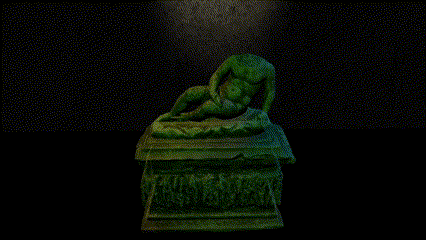
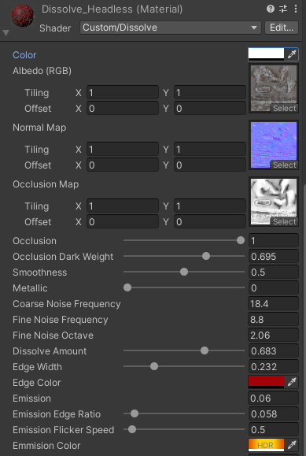

# Dissolve Shader

## Parameters

* `Occlusion`: The occlusion weight
* `Occlusion Dark Weight`: Enhance the darkness of occlusion.
* `Coarse/Find Noise Frequency/Octave`: Adjust the size of the dissolve pattern.
* `Dissolve Amount`: `0` to stop dissolve effect; `1` to fully dissolve the gameobject.
* `Edge Width/Color`: Adjust the edge width and colour.
* `Emission`: Emission intensity.
* `Emission Edge Ratio`: Emmision edge size.
* `Emission Flicker Speed`: Emmision flickers over time. Adjust this parameter to control the flicker speed.
* `Emission Color`: Emission colour.